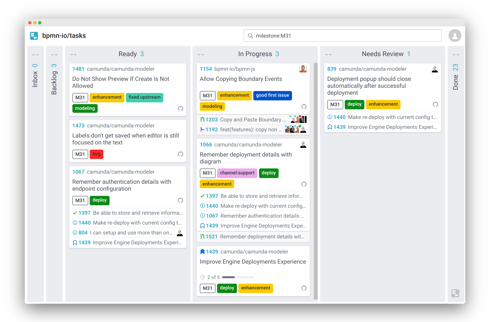

# Wuffle Board

A task board for [GitHub](https://github.com) issues.




## Features

* Multi-repository / organization support
* Private repository support (you only see the issues you are authenticated for)
* Only contributors can update issues
* Configure colums and GitHub label to column mappings
* Automatically moves across columns, as you develop
* Filter issues by name, label, ...
* Manual move across / reorder issues


## How Does Wuffle Compare to...

[Wuffle](https://github.com/nikku/wuffle) has some unique features that sets it apart from the GitHub task board competition:

* __Tightly integrates with the [GitHub flow](https://guides.github.com/introduction/flow/).__ Your issues move automatically across the board. The board is always up to date with things going on in development.

* __[GitHub](https://github.com) is the source of truth.__ Issue columns, relationships and everything else is encoded into  [GitHub issues](https://guides.github.com/features/issues/). The only exception is issue order (which GitHub does not support, so far).

* __Publicly accessible.__ The board board is publicly accessible. It does only display those issues to a visitor that she sees on GitHub, too. You'd like to see cards of your private repositories? Log-in with your GitHub identity and they will pop up on the board.

* __Hackable.__ Wuffle is open source, MIT licensed. Contribute to it to make it even better. Self-host it and stay the owner of your own data. 


## Try it

```
npm install
npm start
```

Goto [`localhost:3001/board`](http://localhost:3001/board) to inspect the board.


## See Also

* [wuffle-sync](https://github.com/nikku/wuffle-sync) - the wuffle synchronization bot


## License

[MIT](LICENSE)
