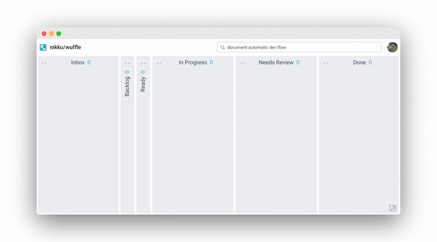

# Automatic Card Movement

We keep the board in sync with your development activities by moving cards from __Inbox__ to __Done__ automatically, as you develop. This document describes how we do it.

## Supported Actions

The following table summarizes triggers and the card movements those cause.

| Trigger | Action |
| :--- | :--- |
| Branch with `{issueNumber}-some-description` created | Issue moves to `IN_PROGRESS` column and is assigned to branch author |
| Collaborator PR is created | PR and linked issue move to `IN_REVIEW` or `IN_PROGRESS` (if PR is draft) column |
| Collaborator PR is marked as draft | PR and linked issue move to `IN_PROGRESS` column |
| Collaborator PR is marked as ready-for-review | PR and linked issue move to `IN_REVIEW` column |
| Collaborator PR receives `changes_requested` review | PR moves to `IN_PROGRESS` column |
| PR is merged | PR and linked issue move to `DONE` column |
| PR is closed unmerged | PR moves to `DONE` column, linked issue stays where it is |
